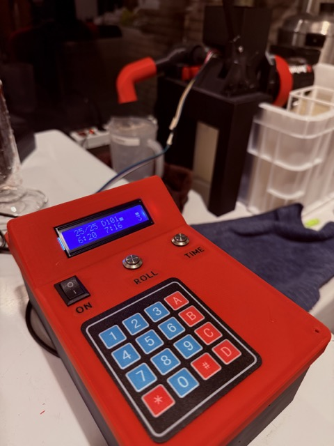

This repository hosts the ESP32 controller code for my build of a 3D printed Jobo cog wheel compatible rotary film processor.

Features:

- Motor control loop that reads the encoder to keep RPM constant at target value, with proper control dampening and smooth reversals.
- Reversal based on measurement of rotation degrees, instead of fixed time.
- LCD display shows RPM, duty, elapsed time, and more.
- Keypad input allows picking presets and specific RPM/duty/rotation targets.
- Count-up timer that can be reset. The previous elapsed time is also shown.
- MQTT support for logging over wifi, including detailed motor metrics, with Python scripts to analyze these.
- OTA updates and remote monitor socket support.
- 3D printable case design available.

My build is strongly based on this 3D model by Franktion, which does not include the controller part:
https://www.printables.com/model/1183451-film-processor-rotationsprozessor-fur-jobo-tank

If you want to build this yourself, you will need some Arduino or C/C++ programming skills, and the ability and patience to debug electronics projects.

## Getting it up and running

This project uses [PlatformIO](https://platformio.org/). Integration is available to VSCode, CLion and many other IDEs. Please refer to the PlatformIO docs for details.

Initial setup for this project:

- Copy `include/secrets.h.example` to `include/secrets.h` and configure your wifi credentials there.
- Copy `platformio.local.ini.example` to `platformio.local.ini` to configure ithe IP for OTA updates over wifi.

## Bill of Materials

These are the major components:

- ESP32 board: NodeMCU 32s devboard
- Aslong JGB37-3530B 76 RPM 24V DC motor (B means it has an encoder)
- Pololu MAX14870 motor driver
- 4+ channel level shifter (5V to 3.3V) that can handle i2c speeds
- 2x16 char i2c LCD display
- 24V 120W power supply
- Voltage step-down converter from 24V to 5V to power the ESP32 and LCD

You can probably use most ESP32 boards, but the pinouts may be different. This was the one I happened to have on hand.

There is also flexibility in the choice of the DC motor (as long as it fits the form factor) and motor driver module.

Schematic: 
[PDF](doc/schematic/filmprocessor-schematic.pdf) 
[other files](doc/schematic/)
[EasyEDA online](https://oshwlab.com/wojas1/film-processor) 

## DC motor choice

When I started this project, I had no experience with DC motors.  I found the following Youtube playlists by [Northwestern Robotics](https://www.youtube.com/@NorthwesternRobotics) very useful for a theoretical understanding of DC motors:

- [Chapter 23: PID Feedback Control](https://www.youtube.com/watch?v=taSlxgvvrBM&list=PLggLP4f-rq02ecj0q0VB9jEbfua8lOc_E)
- [Chapter 25: Brushed Permanent Magnet DC Motors](https://www.youtube.com/watch?v=Mj2bV03mVM8&list=PLggLP4f-rq02o8CuzclHrbdVCEZ1noFEj)
- [Chapter 26: Gearing and Motor Sizes](https://www.youtube.com/watch?v=D1chF7_pIR0&list=PLggLP4f-rq02tJpO5NUa-w0wP_fL_n72n&pp=0gcJCacEOCosWNin)
- [Chapter 27: DC Motor Control](https://www.youtube.com/watch?v=6R_3jHeimiE&list=PLggLP4f-rq03w7Bm5M-EjF8Yn4wL_M7HW)
- [Chapter 28: A Motor Control Project](https://www.youtube.com/watch?v=sMXWoYCmfm4&list=PLggLP4f-rq03WhWvWauGd9ex6ZXGLtrdd)

This project currently does not (yet) follow all the recommendations in these videos.

The DC motor I picked can handle 70 RPM with direction reversal every few seconds. You could pick a version with a higher peak RPM, but lower torque. This should make the motor more quiet. I also read that higher end motors in the same form factor could be more quiet, like Pololu's, but I have not verified this. I went for 24V with the idea that higher voltage = more torque = more better, but a 12V motor may work well enough.

My motor is slightly longer than the one used by the original author, so I had to cut open the motor back of the original 3D model.

## 3D models

My build is strongly based on this 3D model by Franktion:
https://www.printables.com/model/1183451-film-processor-rotationsprozessor-fur-jobo-tank

Over time I have added several 3D model improvements to my own version:

- A separate controller module with LCD and keypad.
- Modular roller system that supports Jobo 1500, 2500 and (untested) 3000 Expert tanks of theoretically any size.
- Tank holder that grips the side of the cog wheel.
- Different mounting system that keeps more of the bucket space available.
- Additional bottle holders.

I will post those designs soon on Printables. In the meantime, you can find, edit and export the models online on Onshape:

- [Film processor mods](https://cad.onshape.com/documents/dad66181e28faef3e8099250/w/1cc0961eebf6790e2034b129/e/8cc60a3bbd29adb3a399e7eb)
- [Electronics enclosure (fits a large breadboard)](https://cad.onshape.com/documents/0af428b88356e718e09b213c/w/1fa9feddcfb3c9018ca2779d/e/8c1548d2bf6ed86b74a06db7)

